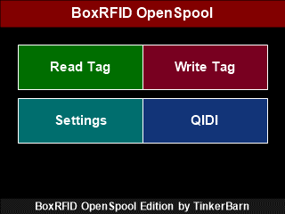

# BoxRFID-Touch

Standalone RFID/NFC touchscreen tool for multiple filament ecosystems on **ESP32-2432S028R (CYD)** with **PN532**.

Supported standalone workflows:

- **OpenSpool Standard** RFID/NFC tags
- **Snapmaker U1** with **paxx12 Extended Firmware** for the extended OpenSpool workflow
- **QIDI Q2**, **QIDI Plus 4**, and **QIDI Max 4** with **QIDI Box**

<p align="center">
  <a href="https://tinkerbarn.github.io/BoxRFID-Touch/">
    
  </a>
</p>

## Web Installer

> The fastest way to get started. No Arduino IDE, no library setup, no TFT_eSPI configuration.

## [Open BoxRFID-Touch Web Installer](https://tinkerbarn.github.io/BoxRFID-Touch/)

The web installer now uses one release selector for the public firmware builds:

- **V4.2 Current Release** for the latest combined firmware
- **V4.1 Stable Previous** if you want the previous combined release
- **V2.1 Classic QIDI** for the classic firmware line
- **V4.0.1 Fallback** for the previous combined QIDI + OpenSpool release

[](https://ko-fi.com/H2H41XBKJ6)

---

## Video

[](https://youtu.be/4cGLlr9Ckx4?is=iYzOwJqUVbCeVkuv)

> Note: This video shows an older workflow and does not yet reflect the current V4.2 release.

---

## Firmware Overview

| Firmware line | Version | Status | Best use case | Installer |
| --- | --- | --- | --- | --- |
| BoxRFID OpenSpool Edition | V4.2 | Current release | Recommended for most users who want QIDI + OpenSpool, Snapmaker U1 sending, and the newest stability fixes | Yes |
| BoxRFID OpenSpool Edition | V4.1 | Stable previous | Previous combined release with QIDI CFG, MicroSD backup/restore, and Wi-Fi tools | Yes |
| BoxRFID OpenSpool Edition | V4.0.1 | Stable fallback | Older combined release kept as fallback if you want to step back from the current release line | Yes |
| BoxRFID OpenSpool Edition | V3.7 | Older combined release | Earlier combined release kept for compatibility and reference | No |
| BoxRFID-Touch | V2.1 | Stable classic | Classic QIDI-only workflow | Yes |
| BoxRFID-Touch | V2.0 | Legacy | Older classic QIDI release kept only for compatibility | No |

Public firmware folders in this repository:

- [BoxRFID-Touch V2.0](./firmware/boxrfid-touch/v2.0/)
- [BoxRFID-Touch V2.1](./firmware/boxrfid-touch/v2.1/)
- [BoxRFID OpenSpool Edition V3.7](./firmware/boxrfid-openspool/v3.7/)
- [BoxRFID OpenSpool Edition V4.0](./firmware/boxrfid-openspool/v4.0/)
- [BoxRFID OpenSpool Edition V4.0.1](./firmware/boxrfid-openspool/v4.0.1/)
- [BoxRFID OpenSpool Edition V4.1](./firmware/boxrfid-openspool/v4.1/)
- [BoxRFID OpenSpool Edition V4.2](./firmware/boxrfid-openspool/v4.2/)

Source folders:

- [BoxRFID-Touch V2.1 source](./source/boxrfid-touch/v2.1/)
- [BoxRFID OpenSpool Edition V3.7 source](./source/boxrfid-openspool/v3.7/)
- [BoxRFID OpenSpool Edition V4.0 source](./source/boxrfid-openspool/v4.0/)
- [BoxRFID OpenSpool Edition V4.0.1 source](./source/boxrfid-openspool/v4.0.1/)
- [BoxRFID OpenSpool Edition V4.1 source](./source/boxrfid-openspool/v4.1/)
- [BoxRFID OpenSpool Edition V4.2 source](./source/boxrfid-openspool/v4.2/)

Documentation:

- [Firmware Matrix](./docs/firmware-matrix.md)
- [Version History](./docs/version-history.md)
- [BoxRFID-Touch V2.1 documentation](./docs/BoxRFID-Touch/BoxRFID-Touch.md)
- [BoxRFID OpenSpool Edition V4.x documentation](./docs/BoxRFID-OpenSpool-Edition/BoxRFID-OpenSpool-Edition.md)

---

## What It Does

BoxRFID-Touch is a standalone reader/writer for compatible filament RFID/NFC tags and boxes, so normal day-to-day use does not require a PC.

It is designed for three clearly separated workflow groups:

- **OpenSpool Standard** RFID/NFC tags
- **Snapmaker U1** with **paxx12 Extended Firmware** using the extended OpenSpool data model
- **QIDI Q2 / Plus 4 / Max 4** used together with **QIDI Box**

Core capabilities across the firmware lines:

- manual tag reading
- automatic tag reading on the main screen
- direct tag writing on the touchscreen
- multilingual user interface
- persistent setup storage
- local editable material and manufacturer lists

Additional capabilities in the OpenSpool Edition:

- QIDI mode and OpenSpool mode in one firmware
- OpenSpool Standard and **Snapmaker U1 / paxx12 Extended Firmware** workflows
- flexible color, HEX, numeric, and variant inputs
- per-model QIDI databases
- MicroSD and Wi-Fi based official QIDI CFG support in the V4.x release line

---

## What's New In V4.2

Latest release highlights:

- current **QIDI Box + OpenSpool + Snapmaker U1 all-in-one release**
- redesigned **Tag senden** workflow for sending tag data directly to **Snapmaker U1 ToolHeads**
- direct ToolHead menu with localized UI text
- mixed-format tag reading for send mode: QIDI and OpenSpool tags are detected automatically, independent of the active firmware mode
- ToolHead status refresh through Snapmaker U1 GET requests, including filament type and color display
- clear `Leer` / `Empty` ToolHead state when no filament data is reported
- automatic contrast selection for ToolHead buttons so text remains readable on light and dark filament colors
- filament-sensor safety check before sending: if filament is detected in the target ToolHead, the firmware asks for confirmation before overwriting
- 3 second tag information popup before returning to the ToolHead send menu
- refreshed ToolHead status after sending so the user can immediately see whether the update arrived
- safer preference loading for edited lists and Wi-Fi/Snapmaker settings to avoid crashes after user-defined QIDI materials/manufacturers
- kept **V4.1**, **V4.0.1**, and **V2.1** in the installer as selectable fallback paths

For the full ongoing release history, see [Version History](./docs/version-history.md).

---

## Which Version Should I Use

- Choose **BoxRFID OpenSpool Edition V4.2** if you want the latest release for **QIDI Box**, **OpenSpool Standard**, and **Snapmaker U1 with paxx12 Extended Firmware**, including direct ToolHead sending.
- Choose **BoxRFID OpenSpool Edition V4.1** if you want the previous combined release.
- Choose **BoxRFID OpenSpool Edition V4.0.1** if you want the previous combined release as a fallback.
- Choose **BoxRFID OpenSpool Edition V3.7** only if you specifically want the older combined release.
- Choose **BoxRFID-Touch V2.1** if you only need the classic QIDI firmware line.
- Use **BoxRFID-Touch V2.0** only if you specifically need the older classic firmware.

---

## Installation

### Web Installer

1. Connect the ESP32 board via USB.
2. Open the [Web Installer](https://tinkerbarn.github.io/BoxRFID-Touch/).
3. Click **Connect**.
4. Select the correct serial port.
5. Choose the desired firmware from the release selector:
   - `V4.2` for the latest combined release
   - `V4.1` for the previous combined release
   - `V4.0.1` for the combined fallback release
   - `V2.1` for the classic QIDI release
6. Flash the firmware.

Notes:

- Use **Chrome** or **Edge**
- Use a **data-capable USB cable**
- Reconnect the board if it is not detected immediately
- If needed, hold the **BOOT** button while connecting
- Flashing will overwrite the existing firmware on the device

### Arduino IDE Settings

The web installer is recommended. If you compile V4.2 manually in Arduino IDE, use these settings:

- Board: **ESP32-2432S028R CYD**
- CPU Frequency: **240MHz (WiFi/BT)**
- Flash Frequency: **80MHz**
- Flash Mode: **QIO**
- Flash Size: **4MB**
- Partition Scheme: **Default 4MB with spiffs (1.2MB APP/1.5MB SPIFFS)**
- Arduino Runs On: **Core 1**
- Events Run On: **Core 1**
- Core Debug Level: **None**
- Zigbee Mode: **Disabled**

Upload speed:

- `921600` can work on many boards.
- If upload stops responding, use `460800` or `115200`.
- Use a data-capable USB cable and hold `BOOT` while connecting if the board is not detected.

---

## Hardware

Main hardware:

- **ESP32-2432S028R CYD**
- **PN532 NFC/RFID module**
- **USB cable**
- **Jumper wires**

Supported tag types:

- **QIDI workflow:** MIFARE Classic 1K tags
- **OpenSpool workflow:** NTAG215 tags

---

## Compatibility

### BoxRFID OpenSpool Edition V4.2

QIDI support:

- **QIDI Q2** with **QIDI Box**
- **QIDI Plus 4** with **QIDI Box**
- **QIDI Max 4** with **QIDI Box**

OpenSpool support:

- **OpenSpool Standard** RFID/NFC tags
- **Snapmaker U1** with **paxx12 Extended Firmware**
- **Snapmaker U1** with **OpenRFID support**
- direct **Snapmaker U1 ToolHead sending** over Wi-Fi when the U1 host and port are configured

### BoxRFID-Touch V2.1

Classic firmware line for:

- **classic QIDI-style workflow**
- **MIFARE Classic 1K tags**

---

## Wiring

Set the PN532 module to **I2C mode** before use.

```text
ESP32-2432S028R CYD    PN532
-------------------    -----
3.3V                -> VCC
GND                 -> GND
GPIO 27             -> SDA
GPIO 22             -> SCL
```

---

## Bill Of Materials

Electronics:

- **ESP32-2432S028R CYD**
  [Amazon Germany](https://www.amazon.de/dp/B0CG2WQGP9)
  [Amazon USA](https://www.amazon.com/dp/B0DNM4SKSJ)
- **PN532 NFC/RFID module**
  [Amazon Germany](https://www.amazon.de/dp/B0D86CPN5J)
  [Amazon USA](https://www.amazon.com/dp/B01I1J17LC)
- **Female to Female USB-C Data Cable**
  [Amazon Germany](https://www.amazon.de/dp/B0DSLNJMDR)
  [Amazon USA](https://www.amazon.com/dp/B0C1X7P9K2)
- **USB-C switch**
  [Amazon Germany](https://www.amazon.de/dp/B0CG11Y3MD)
  [Amazon USA](https://www.amazon.com/dp/B0F23RKY9Z)
- **Jumper wires**

Case:

- [BoxRFID-Touch case on MakerWorld](https://makerworld.com/de/models/2518866-boxrfid-case-rfid-reader-writer-for-qidi-box#profileId-2770921)

---

## Photos And Screenshots

### Hardware

<table align="center">
  <tr>
    <td align="center">
      <br>
      <sub>Electronic parts</sub>
    </td>
    <td align="center">
      <br>
      <sub>PN532 RFID sensor</sub>
    </td>
    <td align="center">
      <br>
      <sub>Set PN532 to I2C mode</sub>
    </td>
    <td align="center">
      <br>
      <sub>ESP32-2432S028R</sub>
    </td>
  </tr>
</table>

### Assembly

<table align="center">
  <tr>
    <td align="center">
      <br>
      <sub>Connect the cables</sub>
    </td>
    <td align="center">
      <br>
      <sub>ESP32 detail view</sub>
    </td>
    <td align="center">
      <br>
      <sub>PN532 detail view</sub>
    </td>
  </tr>
</table>

### Device

<table align="center">
  <tr>
    <td align="center">
      <br>
      <sub>Front view</sub>
    </td>
    <td align="center">
      <br>
      <sub>Back view</sub>
    </td>
    <td align="center">
      <br>
      <sub>Side view</sub>
    </td>
    <td align="center">
      <br>
      <sub>Mounted device</sub>
    </td>
  </tr>
</table>

### Animated V4.x Workflows

The animations below show the **BoxRFID OpenSpool Edition V4.x** write workflows directly on the device UI.

<table align="center">
  <tr>
    <td align="center" width="33%">
      <br>
      <sub><strong>QIDI write workflow</strong><br>Write flow for QIDI mode with manufacturer, material, color selection, and successful tag writing.</sub>
    </td>
    <td align="center" width="33%">
      <br>
      <sub><strong>OpenSpool Standard write workflow</strong><br>Standard OpenSpool tag writing with color picker, HEX input, temperature editing, and successful tag writing.</sub>
    </td>
    <td align="center" width="33%">
      <br>
      <sub><strong>Snapmaker U1 write workflow</strong><br>Extended OpenSpool workflow for Snapmaker U1 including advanced material fields, multiple colors, and successful tag writing.</sub>
    </td>
  </tr>
</table>

### UI Screenshots

> Note: The UI screenshots below currently show an older interface and not the current BoxRFID OpenSpool Edition V4.2 release.

<table align="center">
  <tr>
    <td align="center">
      <br>
      <sub>Home</sub>
    </td>
    <td align="center">
      <br>
      <sub>Read Tag</sub>
    </td>
    <td align="center">
      <br>
      <sub>Write Main</sub>
    </td>
    <td align="center">
      <br>
      <sub>Setup Main</sub>
    </td>
  </tr>
</table>

---

## Related Project

If you need a Windows desktop program, see [BoxRFID](https://github.com/TinkerBarn/BoxRFID).

---

## License

CC BY-NC-SA 4.0
